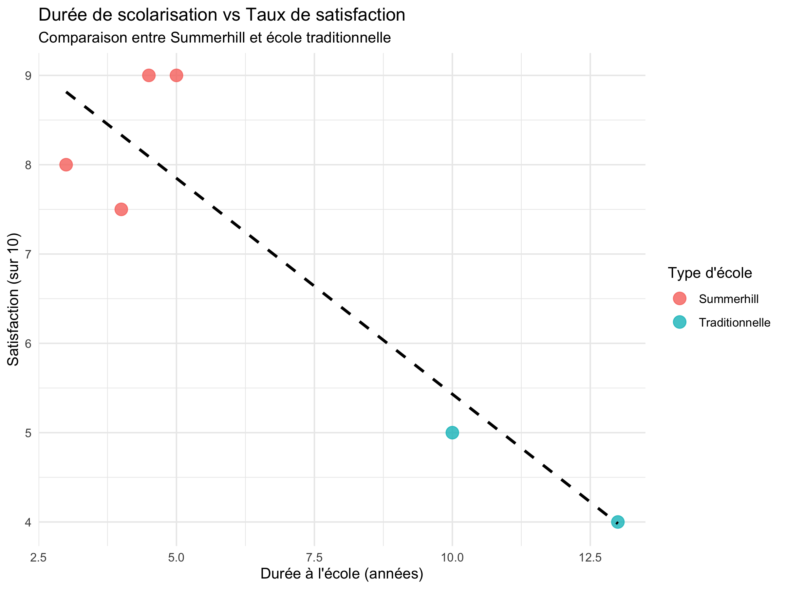

# summerhill_vs_traditionnel

**Comparaison de la satisfaction scolaire entre élèves de Summerhill et du système traditionnel — Projet R (visualisation avec ggplot2)**

---

## Objectif

Ce projet explore la relation entre la durée de scolarisation et le taux de satisfaction d’élèves issus :
- d’une école démocratique (Summerhill)
- d’écoles traditionnelles françaises

Il illustre l’usage de **`ggplot2` dans R** pour visualiser une hypothèse qualitative à partir d'entretiens codés manuellement.

---

## Résultat graphique

---

## Compétences 

- Création d’un `data.frame` à partir de données qualitatives
- Utilisation de `ggplot2` pour créer une visualisation claire
- Export en `.png` avec `ggsave()`
- Structuration reproductible dans un script R
- Documentation lisible et rigoureuse

---

## Fichiers

- `summerhill_analysis_final.R` : code complet et reproductible
- `satisfaction_summerhill.png` : graphique exporté
